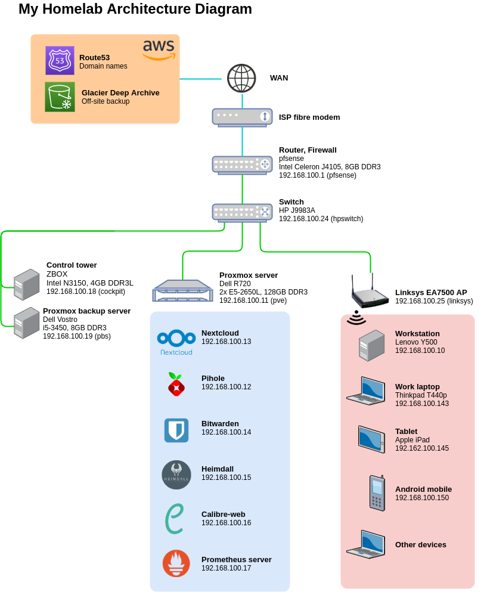

# My Homelab

This page describes my home servers & networking setup.

## Goals

1. Try out services that offer enterprise-level functionalities on my own hardware, while avoiding subscription fees
2. High core-count virtualization server enables setting up ad-hoc VMs for quick experimentations
3. Have fun learning latest technologies

## Summary

The main highlight of this setup is the Dell R720 virtualization server running on Proxmox. Due to the critical nature of data served by Nextcloud and Bitwarden, the disk images are regularly backed up to a separate Proxmox Backup Server with mirrored disks for disaster recovery. Additionally, critical files and photos are uploaded onto Glacier Deep Archive as an offsite backup for even greater peace of mind.

The servers obtain power from a APC UPS connected to the 'Control tower' mini PC. In the event of power failure, it sends a shutdown signal to the VMs, LXC containers and finally to the host to prevent damage to the hardware.

## Architectural Diagram

